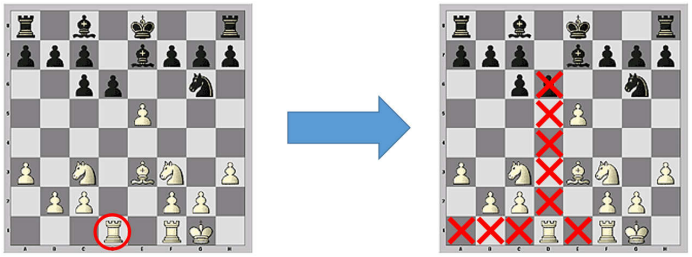
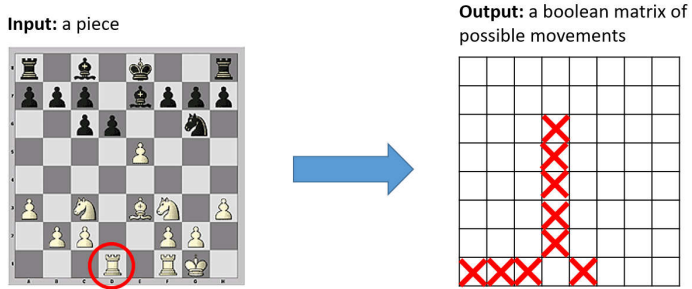

# Sistema de jogo de Xadrez
### (Chess System)
---

This is a project for a chess game system in Java, which involves implementing various OOP concepts. This project is part of the Java course on Udemy: [JAVA OOP](https://www.udemy.com/course/java-curso-completo/?couponCode=MT24125).  
The project was built using Java 17.
- System design

- Possible moves

